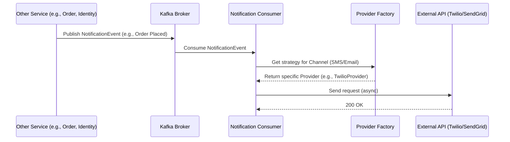

# NotificationService Architecture

The NotificationService uses an event-driven architecture to decouple communication dispatch from the core domain services. 

## Detailed Sequence Diagram

```mermaid
sequenceDiagram
    participant DownstreamService as Other Service (e.g., Order, Identity)
    participant Kafka as Kafka Broker
    participant NotificationConsumer as Notification Consumer
    participant NotificationFactory as Provider Factory
    participant ExternalProvider as External API (Twilio/SendGrid)

    %% Event Consumption Flow
    DownstreamService->>Kafka: Publish NotificationEvent (e.g., Order Placed)
    Kafka->>NotificationConsumer: Consume NotificationEvent
    NotificationConsumer->>NotificationFactory: Get strategy for Channel (SMS/Email)
    NotificationFactory-->>NotificationConsumer: Return specific Provider (e.g., TwilioProvider)
    
    %% Execution Flow
    NotificationConsumer->>ExternalProvider: Send request (async)
    ExternalProvider-->>NotificationConsumer: 200 OK
```
