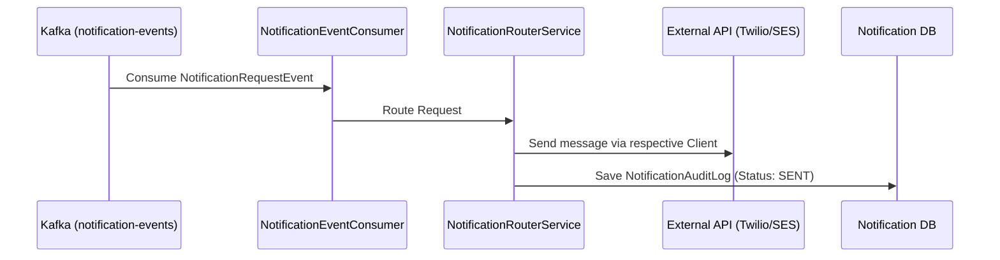

# Communication Integration

The Communication Integration microservice acts as the central notification dispatcher for the Food Delivery platform. It abstracts away third-party communication providers (e.g., AWS SES, Brevo, Twilio, Exotel, Gupshup, Firebase).

## Responsibilities

1. **Event Consumption**: Listens to the `notification-events` Kafka topic for standard `NotificationRequestEvent` messages (defined in CommonLibrary).
2. **Strategy Routing**: Dynamically routes the notification payload to the appropriate channel (SMS, EMAIL, PUSH, WHATSAPP, VOICE) using the Strategy Pattern.
3. **Auditing**: Logs all outgoing notifications to the `notification_db` for tracking and compliance.

## Notification Flow

## Setup

Requires PostgreSQL (`notification_db`) and Kafka. Run `mvn spring-boot:run`.
